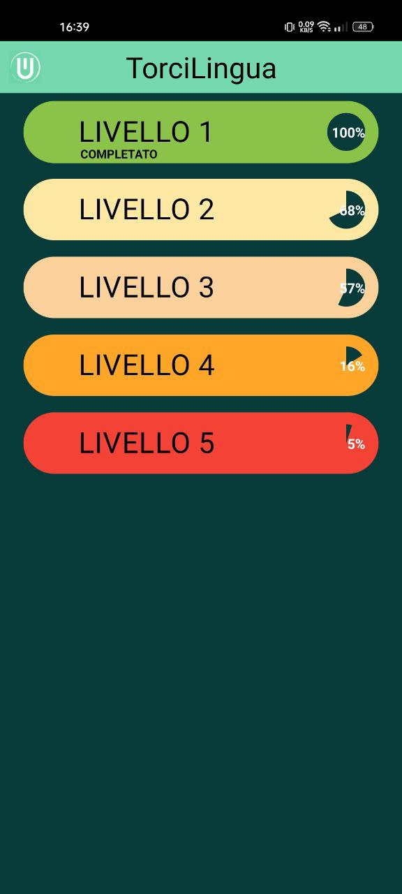
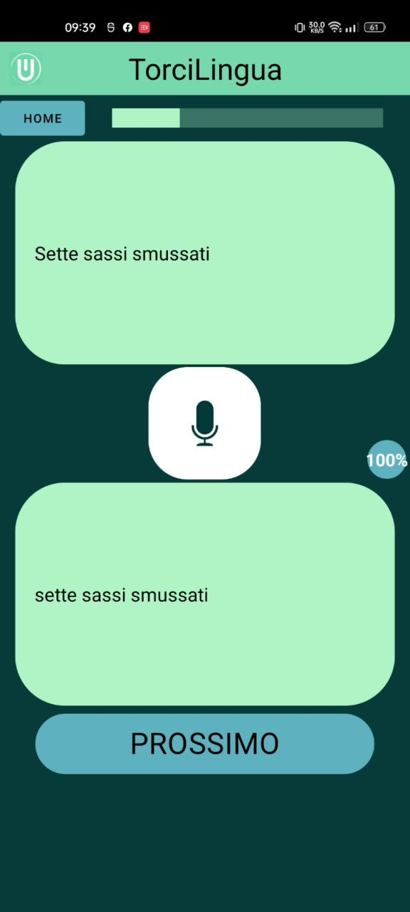
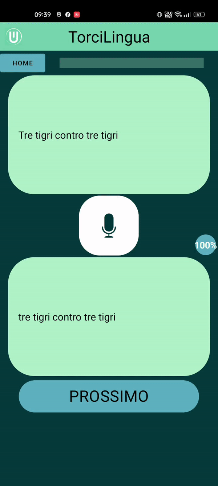

<br/>
<p align="center">
  <a href="https://github.com/skyocrandive/torcilingua">
    
  </a>

  <h3 align="center">TorciLingua</h3>

  <p align="center">
    L'app che testa quanto bene sei in grado di pronunciare gli scioglilingua italiani
    <br/>
    <br/>
    <a href="https://github.com/skyocrandive/torcilingua">View Demo</a>
    .
    <a href="https://github.com/skyocrandive/torcilingua/issues">Report Bug</a>
    .
    <a href="https://github.com/skyocrandive/torcilingua/issues">Request Feature</a>
  </p>
</p>

    

## About The Project

<p align="middle">
  
   
</p>

Mobile app for Android which offers some italian tongue-twisters to pronounce inside five different levels. Each level displays one tongue-twister at a time and has a speech-to-text command usable to write what the user said and to do an estimation of how close is the sentence pronounced by the user to the tongue-twister.

This mobile app is for everyone who wants to play with some tongue-twisters, may it be to improve their own pronunciacion, to help them speak difficult sentences or just for fun.

## Built With

Android App developed with Android Studio and written entirely in Java.

* [Android Studio](https://developer.android.com/studio?gclid=CjwKCAiA5sieBhBnEiwAR9oh2kzYx91uu35juUmaS-TZ6hdv0H-gp9Ddze7FdBuiacz8mBt9qS7EMRoCO9cQAvD_BwE&gclsrc=aw.ds)
* [Java](https://www.java.com/it/)

## Getting Started

Follow these instructions to set up your project locally.

### Prerequisites

* Android Studio
* Java SDK 23 or higher
* Android device

### Installation

1. Clone the repo

```sh
git clone https://github.com/skyocrandive/torcilingua.git
```

2. Import in Android Studio

3. Connect Android device

3. Build on your Android device

4. Enjoy!

## Usage
Demo:
<p align="middle">
  
</p>


## Authors

* **Cristiano Arnaudo** - *Studente Ingegneria Informatica a Bologna* - [Cristiano Arnaudo](https://github.com/skyocrandive)
* **Andrea Munari** - *Studente Ingegneria Informatica a Bologna* - [Andrea Munari](https://github.com/AndreaMunari)

## Acknowledgements

* [abhinav0612](https://github.com/abhinav0612/SpeechToText)
